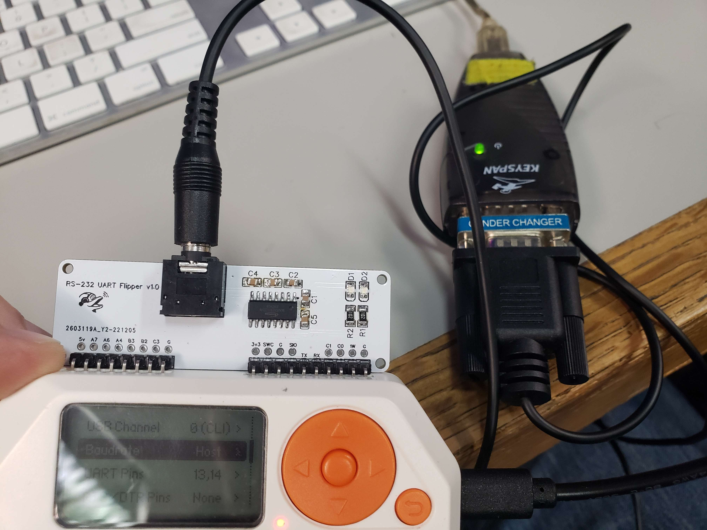
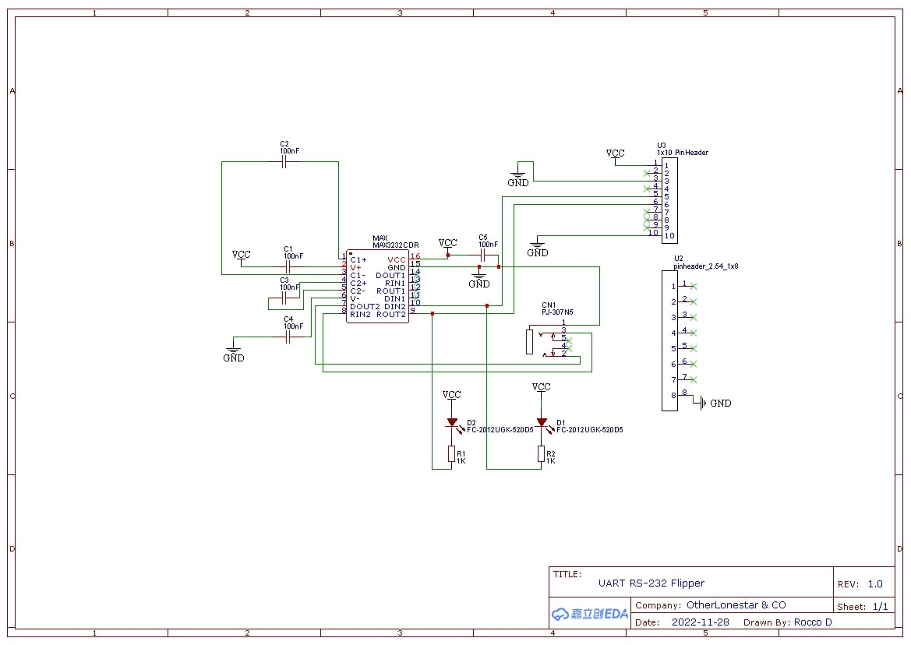

# RS-232-UART-Flipper
This is for an add on board designed for the [flipper zero.](https://flipperzero.one/) It allows the flipper zero to send RS-232 commands through it's USB to UART mode. You can have the raw pcb made at [OSHPARK](https://oshpark.com/shared_projects/RmFaMpFD)

The RS-232 is sent via the 3.5mm TRS Headphone jack. You will need an adapter cable to go from 3.5mm to DB9, RJ12, or RJ45  [LINK](https://www.amazon.com/LIANSHU-DC3-5mm-Serial-RS232-Cable/dp/B07G2ZL3SL)

BOM for Flipper zero add on board

5 x 0805 SMD 100nf ceramic capacitor (Generic common part) Designator Footprint: C1 - C5  
  
1 x TRS headphone jack (part number PJ-307N5)  Designator Footprint: CN1  
  
2 x 1206 SMD 1k resistor Designator Footprint: R1, R2  
  
2 x 0805 SMD LEDs (Generic 20ma ≈2.5v) Designator Footprint: TX, RX  
  
1 x SOP16 MAX3232CDR (most max232 sop16 chips will work but MAX3232 works nicely with 3.3v and uses less power. Check datasheet for Capacitor values if you change the ic) Designator Footprint: MAX 

SCHEMATIC:  

